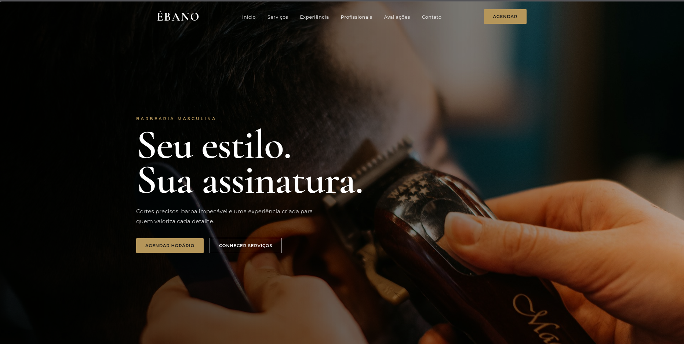

# Ébano — Landing Page para Barbearia

Landing page conceitual desenvolvida para uma barbearia premium, com foco em presença digital, posicionamento de marca e conversão de visitantes em clientes.

  <a href="https://joaopedrocardosodossantos.github.io/barbearia-ebano/">🌐 Ver projeto online</a>

## Sobre o projeto

A **Ébano** foi criada como um projeto de demonstração para representar como uma pequena empresa pode utilizar um site profissional para fortalecer sua presença na internet.

O projeto combina uma identidade visual sofisticada com uma estrutura pensada para apresentar os serviços, transmitir credibilidade e facilitar o contato com novos clientes.

A proposta é mostrar que um site não precisa ser complexo para gerar valor para um negócio.

---

## O objetivo

Uma boa landing page para uma barbearia precisa fazer mais do que simplesmente apresentar informações.

Ela deve:

- transmitir profissionalismo;
- apresentar os serviços de forma clara;
- fortalecer a identidade da marca;
- gerar confiança no visitante;
- destacar os diferenciais do estabelecimento;
- facilitar o agendamento;
- funcionar bem em celulares, tablets e computadores.

A estrutura da Ébano foi desenvolvida pensando nesses objetivos.

---

## Estrutura da página

A landing page possui diferentes seções para conduzir o visitante pela experiência:

### Hero

A primeira impressão do visitante.

Apresenta a identidade da Ébano, sua proposta e chamadas para ação direcionadas ao agendamento e conhecimento dos serviços.

### Serviços

Apresentação dos principais serviços oferecidos pela barbearia, utilizando imagens e informações objetivas.

O objetivo é permitir que o visitante entenda rapidamente o que o estabelecimento oferece.

### Experiência

Uma seção visual destinada a transmitir a atmosfera e o padrão de atendimento da barbearia.

As imagens possuem papel importante na construção da percepção de valor da marca.

### Profissionais

Apresentação dos profissionais responsáveis pelos atendimentos.

Essa seção ajuda a humanizar o negócio e aumentar a confiança do potencial cliente.

### Avaliações

Depoimentos de clientes utilizados como elemento de prova social.

Avaliações são importantes para reduzir a insegurança de quem ainda não conhece o estabelecimento.

### Contato

Informações necessárias para que o visitante possa entrar em contato ou encontrar a localização da barbearia.

### Footer

Área final com navegação complementar, informações da empresa e links importantes.

---

## Design

A identidade visual foi construída para transmitir uma percepção de:

**Elegância • Masculinidade • Sofisticação • Exclusividade**

### Paleta

- Preto — `#151515`
- Preto suave — `#1D1D1B`
- Creme — `#E8E1D5`
- Creme escuro — `#DDD4C5`
- Dourado — `#B5965A`

A combinação de preto, creme e dourado cria uma estética premium sem depender de elementos visuais excessivamente complexos.

### Tipografia

O projeto utiliza:

- **Cormorant Garamond** — títulos e elementos de destaque;
- **Montserrat** — textos, navegação e informações.

A combinação cria contraste entre uma tipografia editorial e uma tipografia moderna e objetiva.

---

## Responsividade

O layout foi desenvolvido para diferentes tamanhos de tela.

### Desktop

A versão desktop aproveita o espaço disponível para apresentar a experiência completa da marca.

### Tablet

O layout reorganiza os elementos para manter boa hierarquia visual em telas intermediárias.

### Mobile

No celular, a navegação é transformada em um menu compacto e as seções passam a utilizar layouts de uma coluna quando necessário.

O objetivo é garantir que a experiência continue consistente independentemente do dispositivo utilizado.

---

## Tecnologias utilizadas

- HTML5
- CSS3
- JavaScript
- Google Fonts
- CSS Grid
- CSS Flexbox
- CSS Media Queries
- Scroll Reveal
- Responsive Web Design

---

## Recursos implementados

- Navegação fixa;
- Menu responsivo;
- Hero com imagem em tela cheia;
- Botões de chamada para ação;
- Cards de serviços;
- Galeria de imagens;
- Apresentação de profissionais;
- Avaliações;
- Seção de contato;
- Layout responsivo;
- Animações e transições;
- Efeitos de hover;
- Scroll suave;
- Estados de foco para acessibilidade;
- Suporte a `prefers-reduced-motion`.

---

## Pensado para negócios reais

Embora a Ébano seja um projeto conceitual, sua estrutura pode ser adaptada para uma empresa real.

Por exemplo:

- substituir o nome e identidade visual;
- utilizar as fotos reais do estabelecimento;
- cadastrar os serviços reais;
- adicionar WhatsApp;
- integrar um sistema de agendamento;
- adicionar Google Maps;
- conectar Instagram;
- configurar domínio próprio;
- otimizar a página para mecanismos de busca.

Assim, uma estrutura semelhante pode ser transformada em uma presença digital completa para uma barbearia ou outro negócio local.

---

## O que este projeto demonstra

Este projeto demonstra minha capacidade de desenvolver páginas que combinam:

**Design + Usabilidade + Responsividade + Conversão**

Mais do que criar uma página visualmente bonita, a proposta é construir uma experiência que ajude uma empresa a apresentar melhor seus serviços e transformar visitantes em potenciais clientes.

---

## Projeto

**Ébano — Barbearia Premium**

Projeto desenvolvido como peça de portfólio para demonstrar uma solução de presença digital para negócios locais.

---

## Desenvolvedor

**João Pedro Cardoso dos Santos**

Desenvolvimento de sites e landing pages para pequenos negócios e profissionais autônomos.

---

> Este projeto é conceitual e foi desenvolvido para fins de demonstração e portfólio.
